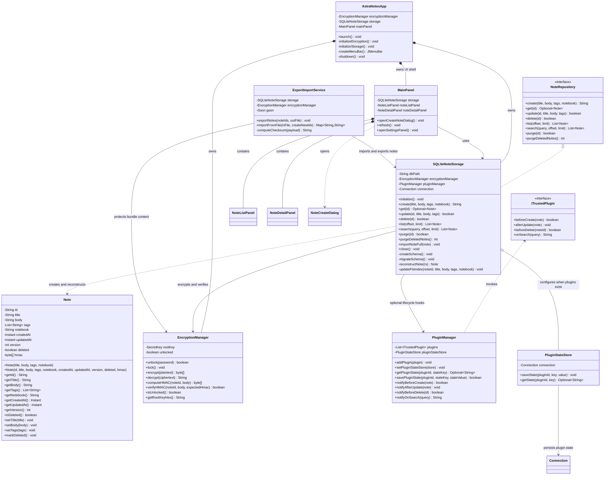
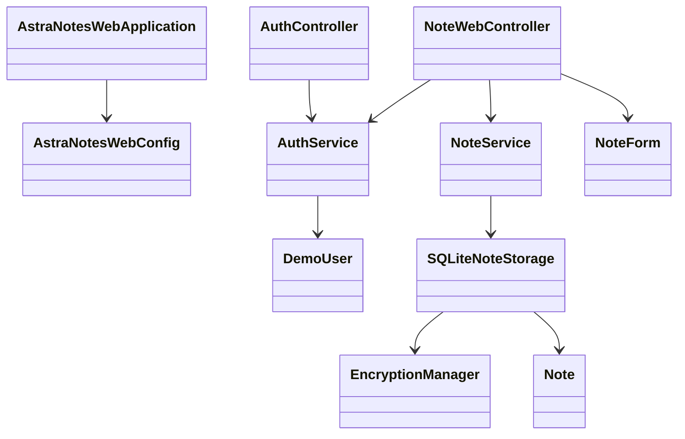
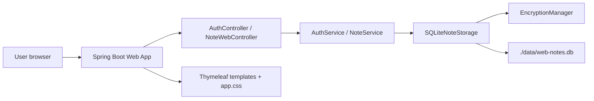

# AstraNotes UML Design Package

## Overview
This document contains five coordinated UML views of the AstraNotes system: class diagram, object diagram, use case diagram, activity diagram, and deployment diagram. All views reflect the SQLite local-first architecture with encryption and trusted plugins.

---

## 1) Class Diagram



### Week 4.1 Structural Rationale

This class diagram is intentionally close to the current Java implementation. It avoids adding speculative classes just to make the diagram look larger. FTS5 indexing and schema migration are currently responsibilities inside `SQLiteNoteStorage`, so they are shown as private methods rather than separate classes.

**Attributes and visibility**
- Private fields (`-`) protect invariants such as `Note.version`, `Note.deleted`, `EncryptionManager.rootKey`, and the SQLite `Connection`.
- Public methods (`+`) expose only the operations needed by the rest of the system, such as CRUD/search on `NoteRepository` and encrypt/decrypt/HMAC methods on `EncryptionManager`.
- Private helper methods in `SQLiteNoteStorage` show implementation responsibilities without exposing database internals to UI or plugin code.

**Association, composition, and inheritance**
- `SQLiteNoteStorage` realizes `NoteRepository`; this is the main inheritance/implementation relationship and keeps storage replaceable.
- `AstraNotesApp` composes `EncryptionManager`, `SQLiteNoteStorage`, and `MainPanel` because it creates and owns the application shell objects for the process lifetime.
- `MainPanel` composes `NoteListPanel` and `NoteDetailPanel` because those panels are part of the UI layout.
- `SQLiteNoteStorage` associates with `EncryptionManager` because storage delegates encryption and HMAC verification instead of implementing cryptography itself.
- `PluginManager` depends on `ITrustedPlugin` through an interface so trusted plugin behavior can vary without changing storage code.
- `ExportImportService` associates with storage and encryption because export/import is an application service built on existing persistence and crypto behavior.

**Why this structure fits AstraNotes**
- The design separates domain model, persistence, encryption, plugins, import/export, and UI responsibilities.
- The central dependency direction is UI -> storage -> encryption/database, which keeps UI code away from SQL and crypto internals.
- Security-sensitive logic is concentrated in `EncryptionManager` and `SQLiteNoteStorage`, making it easier to test and review.
- The diagram supports current requirements without fake complexity and still leaves room to split out future classes such as `MigrationManager` or `SearchIndex` if the implementation grows.

---

## 2) Object Diagram

```
object appContext {
  encryptionManager : EncryptionManager
  noteStorage : SQLiteNoteStorage
  pluginManager : PluginManager
  exportImportService : ExportImportService
}

object noteInstance1 : Note {
  id = "550e8400-e29b-41d4-a716-446655440000"
  title = "Meeting Notes"
  body = [encrypted blob]
  version = 2
  deleted = false
  hmac = [32 bytes]
}

object noteInstance2 : Note {
  id = "6ba7b810-9dad-11d1-80b4-00c04fd430c8"
  title = "Deleted Note"
  body = [encrypted blob]
  version = 1
  deleted = true
  hmac = [32 bytes]
}

object pluginState1 {
  pluginId = "trusted-review-plugin"
  stateKey = "lastSearch"
  stateValue = "meeting"
}

appContext.noteStorage --> noteInstance1
appContext.noteStorage --> noteInstance2
appContext.pluginManager --> pluginState1
appContext.encryptionManager --> noteInstance1 : encrypts/decrypts
```

**Interpretation:**
- At runtime, one `appContext` manages a single `SQLiteNoteStorage` and `EncryptionManager`.
- Multiple `Note` objects exist in the storage, with `version` and `deleted` flags.
- Search indexing is currently managed inside `SQLiteNoteStorage` through the `notes_fts` table.
- Plugin state is stored separately from note rows through `PluginStateStore`.

---

## 3) Use Case Diagram

```
actor User
actor Plugin

User --> (Create Note)
User --> (Read Note)
User --> (Update Note)
User --> (Delete Note)
User --> (Search Notes)
User --> (Export Notes)
User --> (Import Notes)
User --> (Lock/Unlock Vault)

Plugin --> (Receive Note Event)
Plugin --> (Query Notes)

(Create Note) --> (Increment Version)
(Create Note) --> (Encrypt Body)
(Update Note) --> (Increment Version)
(Update Note) --> (Update FTS Index)
(Delete Note) --> (Mark Deleted)
(Search Notes) --> (Query FTS Index)
(Lock/Unlock Vault) --> (Manage Encryption Key)
(Receive Note Event) <-- (Create Note)
(Receive Note Event) <-- (Update Note)
(Receive Note Event) <-- (Delete Note)
```

**Key actors:**
- **User**: performs CRUD, search, export/import, and vault management.
- **Plugin**: receives lifecycle events and can query notes.

**Key use cases:**
- Core CRUD: create, read, update, delete.
- Search and indexing.
- Export/import for backup.
- Vault lock/unlock for key management.
- Plugin event hooks.

---

## 4) Activity Diagram

### Create Note Activity
```
start
  --> [User inputs title, body, tags, notebook]
  --> (Validate input)
  --> {Valid?}
  --> [Yes] (Generate UUID)
  --> (Encrypt body with root key)
  --> (Compute HMAC)
  --> (Insert into SQLite transaction)
  --> (Update FTS5 index)
  --> (Commit transaction)
  --> (Notify plugins: beforeCreate, afterCreate)
  --> [Return note ID to user]
  --> end
  
{Valid?} --> [No] (Display error)
  --> end
```

### Search Note Activity
```
start
  --> [User enters search query]
  --> (Tokenize query)
  --> (Query FTS5 index)
  --> {Results found?}
  --> [Yes] (Retrieve note IDs and metadata)
  --> (Decrypt note previews if needed)
  --> (Order by updatedAt DESC)
  --> (Paginate results)
  --> [Display search results]
  --> end
  
{Results found?} --> [No] (Display "No notes found")
  --> end
```

### Export/Import Cycle
```
start
  --> [User clicks Export]
  --> (Select notes to export)
  --> {Export format?}
  --> [JSON] (Serialize notes with metadata)
  --> [Markdown] (Convert body to .md files)
  --> (Add version/checksum to bundle)
  --> (Write to file)
  --> [User saves file]
  --> end
  
  [Later, user clicks Import]
  --> (Select import file)
  --> (Validate checksum)
  --> (Parse file format)
  --> {Duplicate IDs?}
  --> [Yes] (Assign new UUIDs)
  --> [No] (Keep existing IDs)
  --> (Insert into SQLite)
  --> (Update FTS5 index)
  --> [Confirm import success]
  --> end
```

---

## 5) Deployment Diagram

> Final implementation note: the original UML package modeled the local desktop prototype. The final demo keeps the same domain, storage, encryption, search, and export/import foundation, but runs as a Spring Boot Web MVC application with browser views, session-based demo login, per-user note ownership, and read-only sharing. The desktop deployment diagram below is retained as historical Week 4/5 design evidence; the final web deployment addendum follows it.

```
artifact astranotes.jar {
  component {
    "note.jar" (model.Note)
    "storage.jar" (NoteRepository, SQLiteNoteStorage)
    "encryption.jar" (EncryptionManager)
    "plugin.jar" (PluginManager, ITrustedPlugin, PluginStateStore)
    "io.jar" (ExportImportService)
    "ui.jar" (AstraNotesApp, MainPanel, NoteListPanel, NoteDetailPanel)
  }
}

database sqlite_db {
  "astranotes.db" (SQLite DB; note bodies encrypted with AES-GCM, optional SQLCipher hardening)
}

node UserDesktop {
  device macOS {
    astranotes.jar --> sqlite_db : CRUD + encrypt/decrypt
    astranotes.jar --> password-based KDF : unlock vault
  }
  
  device Windows {
    astranotes.jar --> sqlite_db : CRUD + encrypt/decrypt
    astranotes.jar --> password-based KDF : unlock vault
  }
  
  device Linux {
    astranotes.jar --> sqlite_db : CRUD + encrypt/decrypt
    astranotes.jar --> password-based KDF : unlock vault
  }
}

note on desktop : Current implementation derives an AES key from an unlock password; platform key storage is a future hardening option

filesystem {
  "~/.astranotes/config" : App config
  "~/.astranotes/notes.db" : Encrypted SQLite DB
  "~/.astranotes/backup/" : Periodic snapshots
}

astranotes.jar --> filesystem : Read/write local files
```

**Deployment architecture:**
- Single monolithic JAR deployed on user's desktop.
- SQLite DB stored in a local application directory.
- Current implementation protects note bodies with AES-GCM and HMAC; SQLCipher/full DB encryption is an optional hardening path.
- No network dependencies; fully offline.

---

## 6) Final Web MVC Implementation Addendum

The final AstraNotes demo uses Web MVC while preserving the tested core model and storage design.

### Final Class-Level Mapping



### Final Deployment View



### Final Design Rationale

- `AuthController` owns login/logout routing and session setup.
- `NoteWebController` owns browser routes for list, detail, create, edit, delete, share, search, export, import, profile, and settings.
- `AuthService` defines the demo user set used for class presentation.
- `NoteService` protects the application boundary with validation, owner checks, read-only sharing rules, and export/import coordination.
- `SQLiteNoteStorage` remains the persistence foundation and now supports `owner_id` and `note_shares`.
- Thymeleaf templates are the View layer; they do not directly access SQLite.
- The final deployment is local web demo deployment, not hosted production deployment.

---

## Rationale: How the Views Fit Together

### Class Diagram → Runtime
The **class diagram** defines the static structure. At runtime, the **object diagram** shows how instances of those classes interact: a user creates a `Note` object, `SQLiteNoteStorage` persists it, and `EncryptionManager` encrypts it.

### Use Cases → Activities
The **use case diagram** lists what the system does (create, read, search, export). The **activity diagrams** show the step-by-step flow of those use cases: input validation, encryption, indexing, transaction management, and plugin notification.

### Deployment → Architecture
The **deployment diagram** shows where and how the system runs: as a JAR on the user's desktop, with local SQLite storage and platform-specific key management. It reflects the "local-first, no network" design constraint.

### Consistency Across Views
- **Class → Use Case**: Every use case is supported by a class that implements it (e.g., `NoteRepository.search()` supports the "Search Notes" use case).
- **Use Case → Activity**: Every use case has an activity diagram that details its workflow.
- **Activity → Deployment**: Activities execute within the deployed JAR and interact with the local SQLite DB and key storage.
- **Object → Deployment**: Runtime objects persist to the SQLite DB on the user's desktop, encrypted and indexed.

### Design Alignment
- **Encryption-first**: every view emphasizes encryption (class: `EncryptionManager`, activity: "Encrypt body", deployment: protected note bodies with optional SQLCipher hardening).
- **Plugin-aware**: use cases and activities include plugin hooks; class diagram shows `PluginManager` and `ITrustedPlugin`.
- **Offline-only**: no network components in deployment; all storage is local.
- **Version and audit**: every view reflects versioning (class: `version` field, activity: "Increment Version", object: version instances).

---

## Summary

This UML package provides a complete architectural view of AstraNotes:
1. **Class diagram** defines the modular structure.
2. **Object diagram** shows runtime instances and relationships.
3. **Use case diagram** lists user and plugin interactions.
4. **Activity diagrams** detail the workflows for key operations.
5. **Deployment diagram** shows physical architecture and platform dependencies.

An engineer new to the project can read these diagrams in sequence and understand:
- What components exist and how they interact.
- What the system does for users and plugins.
- How operations flow through the system.
- Where and how the system runs.
